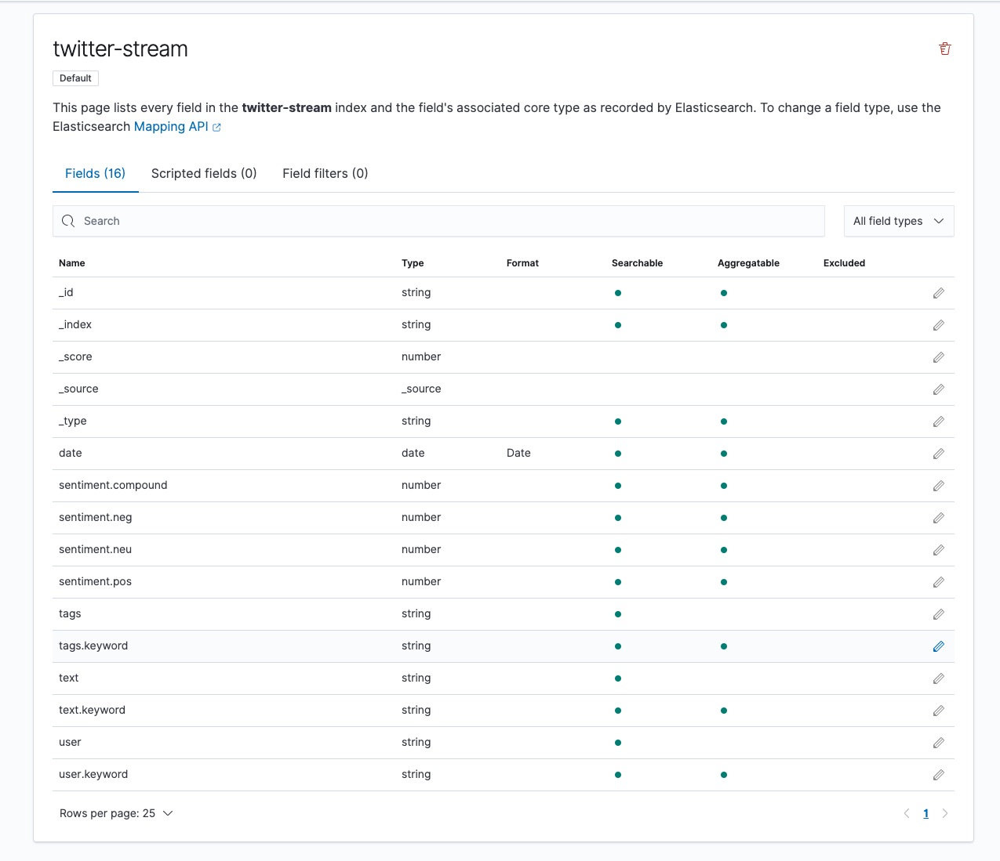
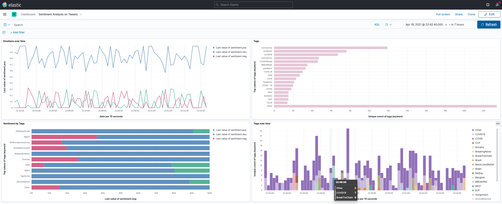

# dsci551_project

The following is a list of instructions that teach you how you can set up the backend environment. Since I tested and deployed my environment on mac, the following commands should only apply on macOS. 

You should easily find the replacement for linux. If you can't, reach me for help @ntsliyang.

## Zookeeper and Kafka
Kafka is the message queue that receives the streaming data from Twitter APIs and the entry points for Spark Streaming API to read the data. 

To install the kafka,

```shell
brew install kafka
```

After kafka is installed, run zookeeper and kafka in different terminal tabs.
```shell
/usr/local/bin/zookeeper-server-start /usr/local/etc/kafka/zookeeper.properties
/usr/local/bin/kafka-server-start /usr/local/etc/kafka/server.properties
```
Since brew should install its packages inside `usr/local/lib`, you should find the two commands above in `usr/local/bin`.

Now you can create a topic called `twitter-stream`.
```shell
/usr/local/bin/kafka-topics --create --zookeeper localhost:2181 --replication-factor 1 --partitions 1 --topic twitter-stream
```

After that, we can initialize a Kafka producer console and consumer console to test the topic.
```shell
/usr/local/bin/kafka-console-producer --broker-list localhost:9092 --topic twitter-stream
```

Similarly, you can creat a consumer topic console.
```shell
/usr/local/bin/kafka-console-consumer --bootstrap-server localhost:9092 --topic twitter-stream --from-beginning
```

You can type random stuff in producer console, and if the topic is created successfully, the same stuff would appear in the consumer console.

## Elasticsearch
Elasticsearch is a powerful search engine.

To install the Elasticsearch, you can follow the [instructions](https://www.elastic.co/guide/en/elasticsearch/reference/current/install-elasticsearch.html). In my end, I tried to install Elasticsearch on macOS with Homebrew.

Run the following command to test
```shell
/usr/local/bin/elasticsearch
```

Check `localhost:9200` and you should get the following message if run successfully.
```markdown
{
  "name" : "xxx",
  "cluster_name" : "xxx",
  "cluster_uuid" : "4108gVQWQnWtBpUHE62y-g",
  "version" : {
    "number" : "7.12.0",
    "build_flavor" : "default",
    "build_type" : "tar",
    "build_hash" : "78722783c38caa25a70982b5b042074cde5d3b3a",
    "build_date" : "2021-03-18T06:17:15.410153305Z",
    "build_snapshot" : false,
    "lucene_version" : "8.8.0",
    "minimum_wire_compatibility_version" : "6.8.0",
    "minimum_index_compatibility_version" : "6.0.0-beta1"
  },
  "tagline" : "You Know, for Search"
}
```

## Kibana
Kibana is a useful visualization tool that will help us to build UI easily.

To install the Kibana, you can follow the [instructions](https://www.elastic.co/guide/en/kibana/current/install.html). In my end, I also tried to install Kibana using Homebrew.

Run the following command to test
```shell
/usr/local/bin/kibana
```

Check `localhost:5601` and it should redirect you to a home interface.

## Start Consumer
Before starting the consumer, make sure the following environment variables are set properly.
```shell
# java
export JAVA_HOME=$(/usr/libexec/java_home)

# spark
export PYSPARK_PYTHON={your python3.8 path}
export SPARK_HOME={path}/spark-3.0.2-bin-hadoop3.2
export PATH=$PATH:{path}/spark-3.0.2-bin-hadoop3.2
```

You can reference my [spark-submit.sh](api/spark-submit.sh) to make sure they are set properly.

Then, [submit application](https://spark.apache.org/docs/3.0.2/submitting-applications.html) by running the following command inside `api` directory.
```shell
/usr/local/bin/spark-submit --packages org.apache.spark:spark-sql-kafka-0-10_2.12:3.0.2 consumer.py
```

NOTE: I use pyspark-3.0.2 instead 3.0.1 mentioned in software installation instructions because 3.0.1 can no longer be downloaded from website. Therefore, if you choose to use 3.0.1, replace the command above with 3.0.1

## Start Producer

This is simple, just run producer inside project root directory.
```shell
python3 producer.py
```

## Monitor Dataflow
check whether there is any error message, especially in the consumer's terminal session. If the consumer's terminal session outputs tweets normally, you can start visualization by doing the following steps.

### Create an Index Pattern
You can follow the [instructions](https://www.elastic.co/guide/en/kibana/current/index-patterns.html) to create an index pattern named `twitter-stream`. After that, you can see something like this:


### Create a Visualization
You can follow the [instructions](https://www.elastic.co/guide/en/kibana/7.12/create-a-dashboard-of-panels-with-web-server-data.html) to create visualizations that you think make sense. I have created something like this:


### Embed the Code in Web Pages
You can follow the [instructions](https://www.elastic.co/guide/en/kibana/current/embedding.html).

## Troubleshooting
- [multithreading issue on macOS](https://stackoverflow.com/a/52230415): if your console outputs following message:
```
+[__NSPlaceholderDate initialize] may have been in progress in another thread when fork() was called. We cannot safely call it or ignore it in the fork() child process. Crashing instead.
```
That means you need to set the following environment variable due to added security of macOS High Sierra:
```
OBJC_DISABLE_INITIALIZE_FORK_SAFETY=YES
```
